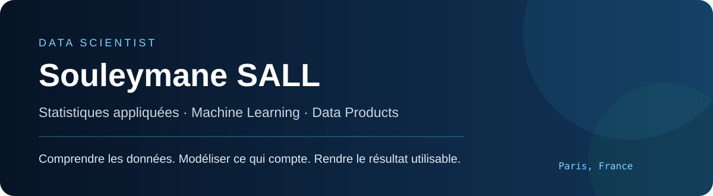

<a href="https://www.linkedin.com/in/souleymanes-sall">LinkedIn</a> · <a href="https://www.souleymanesall.dev/">Portfolio</a> · <a href="mailto:sallsouleymane2207@gmail.com">Email</a> · <a href="https://medium.com/@sallsouleymane66">Medium</a>

## Stack technique

### Mes outils principaux

<table>
<tr>
<td align="center" width="120"> <b>Python</b></td>
<td align="center" width="120"> <b>SQL</b></td>
<td align="center" width="120"> <b>Power BI</b></td>
<td align="center" width="120"> <b>GCP</b></td>
</tr>
</table>

### Et aussi

<table>
<tr>
<td align="center" width="100"> <b>R</b></td>
<td align="center" width="100"> <b>SAS</b></td>
<td align="center" width="100"> <b>Excel</b></td>
<td align="center" width="100"> <b>GitHub</b></td>
<td align="center" width="100"> <b>BigQuery</b></td>
<td align="center" width="100"> <b>scikit-learn</b></td>
<td align="center" width="100"> <b>Streamlit</b></td>
<td align="center" width="100"> <b>Docker</b></td>
<td align="center" width="100"> <b>FastAPI</b></td>
</tr>
</table>

## À propos

Je travaille sur des problèmes où un modèle doit finir par **éclairer une décision**, pas seulement produire une métrique.

Ma formation en économétrie et statistiques appliquées m’a donné une base solide en modélisation. Mes projets m’ont ensuite amené à travailler sur toute la chaîne : comprendre le besoin, préparer les données, construire et évaluer le modèle, puis rendre le résultat accessible via une API, un dashboard ou une application.

<table><tr><td width="33%" align="center"><b>Analyser</b> Comprendre les comportements, les risques et les mécanismes présents dans les données.</td><td width="33%" align="center"><b>Modéliser</b> Choisir une méthode adaptée à la décision, puis mesurer clairement ses limites.</td><td width="33%" align="center"><b>Rendre utilisable</b> Transformer le résultat en score, API, dashboard ou application exploitable.</td></tr></table>

## Projets sélectionnés

### Segmentation client & recommandation
À partir de données transactionnelles retail, j’ai construit une analyse combinant **segmentation RFM**, profils clients et règles d’association. L’objectif est de passer d’un historique d’achats à des groupes compréhensibles et à des recommandations produit exploitables.

**6 segments clients · Market Basket Analysis · Application déployée**

`Python` `Pandas` `scikit-learn` `MLxtend` `Plotly` `Streamlit`

[Code](https://github.com/Souley225/customer-segmentation-rfm) · [Tester l’application](https://customer-segmentation-project-591h.onrender.com/)

### Scoring du churn client
Un pipeline de machine learning construit autour d’une question opérationnelle : **quels clients présentent le plus grand risque de départ ?** Le projet couvre le feature engineering, la comparaison de modèles, le suivi des expériences et le déploiement. Le score est accessible via une application et une API.

`MLflow` `DVC` `Optuna` `FastAPI` `Docker` `Streamlit`

[Code](https://github.com/Souley225/customer-churn-analysis) · [Tester l’application](https://customer-churn-project-zv7e.onrender.com/)

### Optimisation des prix
J’ai modélisé la demande pour étudier l’**élasticité-prix**, simuler différents scénarios et recommander un prix sous contraintes. Dans l’évaluation du projet, LightGBM atteint un RMSE de **77,59 contre 100,67** pour la baseline ElasticNet, soit environ **23 % de réduction**.

`LightGBM` `SciPy` `MLflow` `DVC` `FastAPI` `Docker`

[Code](https://github.com/Souley225/pricing-optimization-analysis) · [Tester l’application](https://pricingoptimisationproject-production.up.railway.app/)

### Détection de phishing par NLP
Classification de liens à partir de signaux extraits des URLs et de représentations textuelles. Le travail porte autant sur la construction des variables que sur le compromis entre détection et fausses alertes.

`Python` `scikit-learn` `XGBoost` `TF-IDF` `spaCy`

[Code](https://github.com/Souley225/NLP_Phishing_detection_Project)

## Expérience

### Data Scientist – Stage | Micropole · Groupe Talan
**Mars 2025 – Sept. 2025 · Paris, France**

- Pilotage de bout en bout d’un projet de segmentation client pour un acteur du e-commerce, afin d’améliorer la connaissance client, le ciblage marketing et les actions de fidélisation.
- Conception d’un pipeline de données intégrant l’extraction depuis Salesforce, le stockage sur Google Cloud Platform (GCS), ainsi que le nettoyage, la préparation et la structuration des données.
- Développement d’un modèle de segmentation permettant d’identifier **10 profils clients distincts** à partir des comportements d’achat, puis caractérisation des segments pour identifier leurs principaux leviers d’activation marketing.
- Réalisation d’une analyse de paniers (**Market Basket Analysis**) afin d’identifier les associations de produits et d’alimenter des recommandations personnalisées selon les segments de clientèle.
- Création de tableaux de bord décisionnels permettant aux équipes métier d’exploiter les segments et de piloter les campagnes marketing.

## Projets

### Modèle de scoring décisionnel – Mobilize Financial Services
**Python · SAS · Excel**

- Modélisation du risque de défaut à partir de données de demandes de prêt.
- Mise en place d’une grille de score permettant d’évaluer chaque demande de crédit.
- Construction d’indicateurs destinés à accompagner la décision d’octroi de crédit.
- Analyse et restitution des résultats afin de rendre les conclusions du modèle compréhensibles par les équipes métier.

### Analyse du marché immobilier français
**Python · Streamlit · Excel**

- Collecte et centralisation de données publiques issues de data.gouv.fr, suivies du nettoyage, de la structuration et de la préparation des données.
- Construction d’indicateurs sur les prix, volumes et tendances du marché immobilier.
- Création d’un dashboard interactif Streamlit permettant d’explorer les données par commune et département.
- Analyse des dynamiques territoriales afin d’identifier les écarts entre zones et restitution des résultats pour faciliter la prise de décision.

## Ma façon d’aborder un projet

**Quelle décision cherche-t-on à améliorer ?** Elle détermine ce qu’il faut mesurer et évite de transformer le projet en concours de métriques.

**Qu’est-ce que les données permettent réellement d’affirmer ?** Un résultat utile doit rester défendable, y compris quand les données sont imparfaites.

**Comment le résultat sera-t-il utilisé ?** Un modèle qui reste dans un notebook répond rarement à toute la question. Selon le besoin, la dernière étape peut être un score, une API, un dashboard ou une application.

## Formation

**Master Économétrie & Statistique Appliquée**, Université d’Orléans, 2023–2025  
Modélisation statistique · Scoring · Machine Learning supervisé et non supervisé · Séries temporelles · Économétrie · SQL · SAS

**Licence Économie Quantitative**, Université de Bourgogne-Europe, 2019–2023

## Certifications

SAS Certified Statistical Business Analyst · SAS Base Programming · Python for Data Science · Dataiku Core Designer & ML Practitioner · SQL & Power BI

## Activité GitHub

Ce profil documente des projets que je peux expliquer, défendre et améliorer, pas seulement des notebooks qui s’exécutent.
